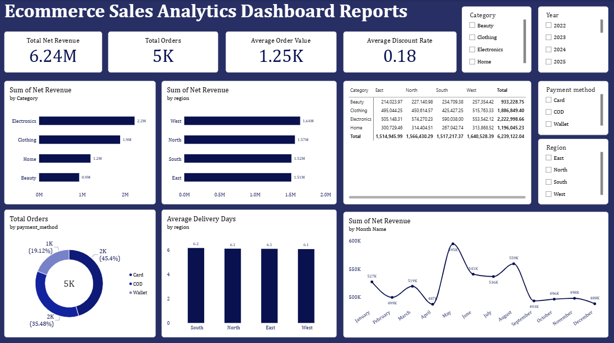

# E-Commerce-Analytics

## Dashboard Preview

---
## Project Overview

This project analyzes 5,000 e-commerce orders to understand revenue performance, customer payment behavior, and delivery operations across four product categories and four regions. The raw CSV was cleaned and transformed in Power Query, modeled with a dedicated date table in Power BI, and built into an interactive dashboard with KPI cards, slicers, and drill-down visuals.

---
## Problem Statement

Sales and operations data was sitting in a flat, unstructured CSV with no way to monitor performance over time, by category, by region, or by payment method. There was no single view to track revenue trends, spot underperforming segments, or confirm whether delivery service was consistent across regions.

---
## Business Questions Answered

* What is total revenue, order volume, and average order value, and how much of potential revenue is lost to discounting?
* Which product categories and regions generate the most revenue?
* How does revenue trend month to month, and are there seasonal peaks or dips?
* How do customers prefer to pay, and how is that split across the customer base?
* Is delivery speed consistent across regions, or do some regions lag?

---
## Customer Experience

Card payments lead at 45.4% of orders, followed by Cash on Delivery at 35.5% and Wallet payments at 19.1%, showing customers are reasonably split across payment options rather than relying on one method. Average delivery time sits at roughly 6.1-6.2 days and is nearly identical across all four regions, indicating consistent fulfillment performance rather than any region being underserved.

---
## Demand and Availability

Electronics is the top-performing category at 2.2M in revenue, followed by Clothing at 1.9M, Home at 1.2M, and Beauty at 0.9M. Regionally, demand is fairly balanced: West leads at 1.64M, with North, South, and East each close behind in the 1.5M-1.57M range. The Category x Region matrix shows Electronics is the strongest performer in every region individually, not just in the overall total.

---
## Tools Used

* Power Query
* Power BI data modeling
* DAX measures
* Dashboard build

  ## Repository Structure
* [Raw dataset](Ecommerce_Sales_Analytics_Dataset.csv)
* [Power BI file](Ecommerce-Sales-Analytics.pbix)
* [Dashboard screenshot](Ecommerce_Sales_Overview.png)
* README.md — project write-up

---
## Key Insight

Revenue is not flat across the year: it dips in April (487K) and September (493K) but spikes sharply in May (595K), meaning demand is seasonal rather than steady. Electronics consistently outperforms every other category in every region, and delivery performance is uniform nationwide at around 6 days, so service consistency is not the differentiator between regions, product mix is.

---
## Business Recommendation

Prioritize Electronics inventory and marketing investment ahead of the May demand spike, and investigate what drove the April and September dips (promotions, stock-outs, or seasonality) so they can be planned for or mitigated. Since delivery times are already consistent across regions, operational investment is better spent on category-level demand planning and payment-method-specific promotions (e.g. incentivizing Wallet adoption, currently the smallest share) rather than on regional logistics fixes.
